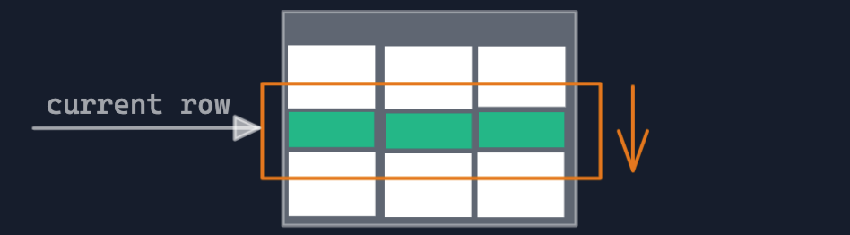

# Table of Contents

1. [What is Window Functions?](#what-is-window-functions)
2. [Difference between Aggregate Functions vs. Window Functions](#difference-between-aggregate-functions-vs-window-functions)
3. [Syntax and basic setup](#syntax-and-basic-setup)
4. [Over() and Partition by](#over()-and-partition-by)
### **What is `Window Functions`?**
Window Functions compute their result based on a sliding window frame, a set of rows that are somehow related to the current row.
 

### **Difference between `Aggregate Functions` vs. `Window Functions`**
Easiest way to understand window function is to start by reviewing the aggregate function (SUM, AVG, MIN...). Aggregate function aggregate data 
from a set of rows into a **single row**. In Window function, it does **not reduce the number of rows**
return.
Aggregate Functions            |  Window Functions
:-------------------------:|:-------------------------:
  |  

### **Syntax and basic setup**

```sql
SELECT <column_1>, <column_2>,
<window_function> OVER (
    PARTITION BY <...>
    ORDER BY <...>
    <window_frame>) <window_column_alias>
FROM <table_name>;
```
A window function call always contains an `OVER` clause.
`PARTITION BY`, `ORDER BY`, and window frame definition are all optional.

**`PARTITION BY`** divides rows into multiple groups, called partitions, to which the window function is applied.

**`ORDER BY`** specifies the order of rows in each partition to which the window function is applied. It does not even have to match the order in which the rows are output.

**Window Frame:** is a set of rows that are somehow related to the current row. The window frame is evaluated separately within each partition.

**Create table**

```sql
CREATE TABLE sales (
    id serial NOT NULL PRIMARY KEY,
    month integer,
    country varchar(50),
    city varchar(50),
    sold integer
);
```

**Insert into table**

```sql
INSERT INTO sales VALUES
    (1, 1, 'India', 'Indore', 300),
    (2, 2, 'India', 'Indore', 500),
    (3, 1, 'France', 'Paris', 200),
    (4, 2, 'France', 'Paris', 300),
    (5, 3, 'France', 'Paris', 700),
    (6, 1, 'United Kingdom', 'London', 100),
    (7, 2, 'United Kingdom', 'London', 400),
    (8, 1, 'India', 'Pune', 300),
    (9, 2, 'India', 'Pune', 500),
```
### **Over() and Partition by**

**Select query for sum of sold**

`OVER()` - if over is used means window function was used.

Default Partition: With no `PARTITION BY` clause, the entire result set is the partition.


```sql
SELECT city, month, sold,
  sum(sold) OVER () total
FROM sales;

Result -
------------+-----+------+------
city        |month| sold | total
------------+-----+------+------
Indore  	| 2	  |  300 | 2700 
Indore  	| 1	  |  500 | 2700
London  	| 1	  | 200  | 2700
London  	| 2	  | 300  | 2700
Paris   	| 2	  | 700  | 2700
Paris   	| 1	  | 100  | 2700
Paris   	| 3	  | 400  | 2700
Pune    	| 1	  | 100  | 2700
Pune        | 2	  | 100  | 2700
```

**Select query for `Partition BY`**

`PARTITION BY` divides rows into multiple groups, called partitions, to which the window function is applied.

```sql
SELECT city, month, sold,
  sum(sold) OVER (
    PARTITION BY city 
    ) total
FROM sales;

Result -
------------+-----+------+-----
city        |month| sold | total
------------+-----+------+-----
Indore	    | 1	  | 300	 | 800
Indore	    | 2	  | 500	 | 800
London	    | 1	  | 100	 | 500
London	    | 2	  | 400	 | 500
Paris	    | 3	  | 700	 | 1200
Paris	    | 1	  | 200	 | 1200
Paris	    | 2	  | 300	 | 1200
Pune	    | 1	  | 100	 | 200
Pune	    | 2	  | 100	 | 200
```


