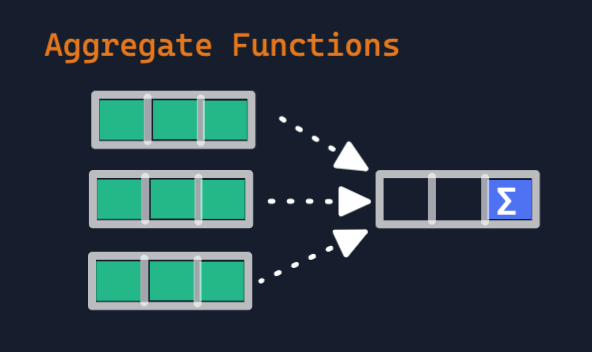
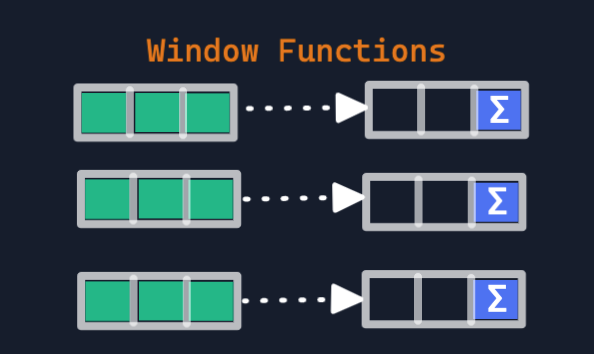

# Table of Contents

1. [What is Window Functions?](#what-is-window-functions)
2. [Difference between Aggregate Functions vs. Window Functions](#difference-between-aggregate-functions-vs-window-functions)
### **What is `Window Functions`?**
Window Functions compute their result based on a sliding window frame, a set of rows that are somehow related to the current row.
 

### **Difference between Aggregate Functions vs. Window Functions**
Easiest way to understand window function is to start by reviewing the aggregate function (SUM, AVG, MIN...). Aggregate fun. aggregate data 
from a set of rows into a single row. In Window function, it does not reduce the no. of rows
return.
Aggregate Functions            |  Window Functions
:-------------------------:|:-------------------------:
  |  